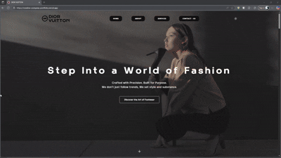
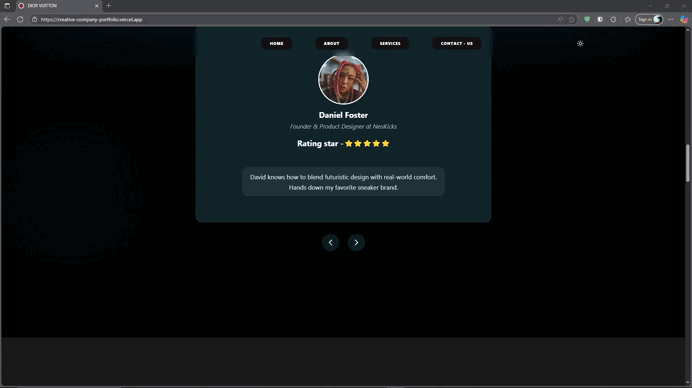
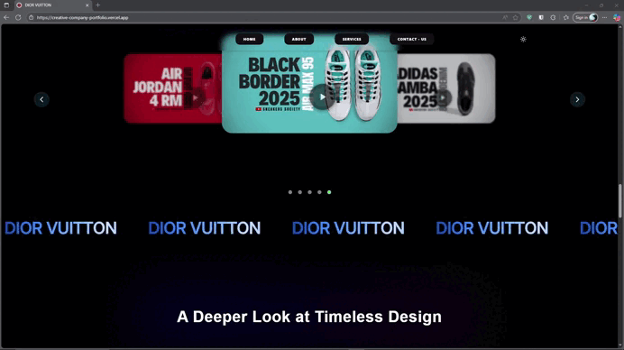
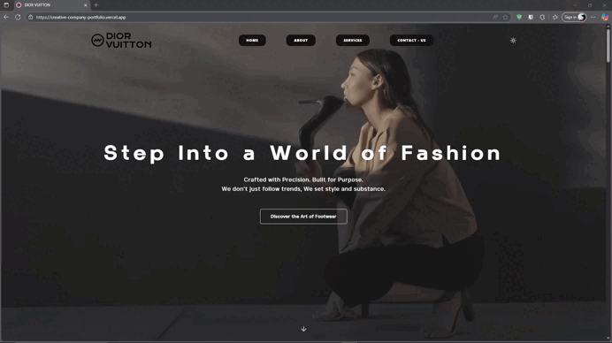

<p align="center">
  <a href="https://github.com/rafeul19/Creative-Company-Portfolio" target="_blank">
    <picture>
      <source media="(prefers-color-scheme: dark)" srcset="https://i.postimg.cc/gjmFCTWt/logo-header.png">
      
    </picture>
  </a>
</p>
<p align="center">
  <a>
  <br />
  </a>
</p>
<p align="center">
  <a href="https://opensource.org/license/mit">
    
  </a>
</p>

<p align="center">
  <strong>👨‍💻 Created by Md. Rafeul Islam Rafe </strong>
</p>

<p align="center">
  <a href="https://github.com/rafeul19" target="_blank">
    
  </a>
  <a href="https://www.linkedin.com/in/md-rafeul/" target="_blank">
    
  </a>
</p>


<div align="center">
  <strong>
    <h2>🎨 Professional Creative Agency Portfolio Website</h2>
    <br />
    <a href="https://creative-company-portfolio.vercel.app/">Creative Company Portfolio</a>: A modern alternative to traditional portfolio websites<br />
    Showcase your creative work, services, and team in style  and smooth animations.<br /><br />
  </strong>
  
  A stunning, responsive portfolio website designed for creative companies and agencies<br />
  to showcase their work, services, and team with modern design and smooth animations.
</div>


## ⚙️ Tech Stack


<div class="flex" align="center">
  <br />
  
  
  
      
  
  
  
  
  
  
  
  
    
          
          


</div>

<p align="center">
  <br />
  <a href="[https://rafeul19.github.io/Creative-Company-Portfolio" rel="dofollow](https://creative-company-portfolio.vercel.app/)"><strong>🚀 View Live Demo »</strong></a>
  <br />
  <br />
  <a href="#quick-start" rel="dofollow"><strong>📖 Quick Start Guide »</strong></a>
  <br />
  <br/>
  <a href="https://creative-company-portfolio.vercel.app/">Live Demo</a>
  ·
  <a href="https://github.com/rafeul19/Creative-Company-Portfolio/issues">Report Bug</a>
  ·
  <a href="https://github.com/rafeul19">Portfolio</a>
  ·
  <a href="mailto:rafe.19.dev@gmail.com">Contact</a>
</p>

<br />

<p align="center">
  
</p>

## ✨ Features

|  |
| ----------------------------------------------------------------------------------------------------- | --------------------------------------------------------------------------------------------- |
| **📱 Fully Responsive**<br/>Perfect viewing experience across all devices                             | **🎨 Modern Design**<br/>Clean, professional and visually appealing                           |

 |   |
| ----------------------------------------------------------------------------------------------------- | ----------------------------------------------------------------------------------------------------- |
| **🖼️ Portfolio Gallery**<br/>Interactive showcase with lightbox functionality                         | **⚡ Smooth Animations**<br/>Engaging hover effects and transitions                                   |

## 🎯 Live Demo

<p href="https://creative-company-portfolio.vercel.app/"> 🎯 Live Demo </p>

<a href="https://creative-company-portfolio.vercel.app/">Live Demo</a>


# 🚀 Introduction

- **🎯 Showcase Your Work** - Display your creative projects with stunning portfolio gallery
- **💼 Professional Services** - Highlight your company's expertise and offerings
- **👥 Team Presentation** - Introduce your creative professionals
- **📞 Easy Contact** - Streamlined client communication and inquiries
- **🎨 Modern Design** - Clean, professional, and visually appealing interface


## 🎯 Key Sections

- **🏠 Hero Section** - Eye-catching introduction with compelling CTA
- **ℹ️ About Us** - Company story, mission, and values
- **🛠️ Services** - Detailed showcase of your creative services
- **🖼️ Portfolio** - Interactive gallery of your best work
- **👥 Team** - Meet the creative minds behind your company
- **📧 Contact** - Professional contact form and information

## 👌 Quick Start

### Prerequisites

- [Node.js](https://nodejs.org/) (version 16 or higher)
- [npm](https://www.npmjs.com/) or [yarn](https://yarnpkg.com/)
- [Git](https://git-scm.com/)
- A modern web browser
- Code editor (VS Code recommended)

### Cloning the Repository

```bash
git clone https://github.com/rafeul19/Creative-Company-Portfolio
cd Creative-Company-Portfolio
```

### Installation & Setup

```bash
# Install dependencies
npm install
```

```bash
# Alternative: Using Yarn
yarn install
```

### Running the Development Server

```bash
# Start development server
npm run dev
```

```bash
# Alternative: Using Yarn
yarn dev
```

Your development server will be running at [http://localhost:5173](http://localhost:5173) (Vite's default port).

### Building for Production

```bash
# Build for production
npm run build
```

```bash
# Preview production build locally
npm run preview
```

### Available Scripts

- `npm run dev` - Start development server with hot reload
- `npm run build` - Build for production
- `npm run preview` - Preview production build locally
- `npm run lint` - Run ESLint for code quality checks

### Development Workflow

1. **Start Development**: Run `npm run dev` to start the development server
2. **Live Reload**: Changes are automatically reflected in the browser
3. **Build & Test**: Use `npm run build` to create production build
4. **Preview**: Use `npm run preview` to test production build locally

### Environment Setup

Create a `.env` file in the root directory for environment variables:

```bash
# .env
VITE_API_URL=your_api_url_here
VITE_CONTACT_EMAIL=your_email_here
```

Your site will be running with hot module replacement and all modern development features enabled.


## 💻 Project Structure

```
Creative-Company-Portfolio/
├── 📄 index.html              # Vite entry point
├── 📄 package.json            # Dependencies and scripts
├── 📄 package-lock.json       # Dependency lock file
├── 📄 vite.config.js          # Vite configuration
├── 📄 tailwind.config.ts      # Tailwind CSS configuration
├── 📄 eslint.config.js        # ESLint configuration
├── 📄 tsconfig.json           # TypeScript configuration
├── 📁 src/
│   ├── 📄 main.tsx            # React app entry point
│   ├── 📄 App.tsx             # Main App component
│   ├── 📄 index.css           # Global styles with Tailwind
│   ├── 📁 components/         # React components
│   │   ├── 🏠 Hero.tsx        # Hero section component
│   │   ├── ℹ️ About.tsx       # About section component
│   │   ├── 🛠️ Services.tsx    # Services section component
│   │   ├── 🖼️ Portfolio.tsx   # Portfolio gallery component
│   │   ├── 👥 Team.tsx        # Team section component
│   │   ├── 📧 Contact.tsx     # Contact form component
│   │   └── 🧩 ui/             # Reusable UI components
│   ├── 📁 assets/
│   │   ├── 🖼️ images/         # Image assets
│   │   │   ├── portfolio/     # Portfolio showcase images
│   │   │   ├── team/          # Team member photos
│   │   │   ├── services/      # Service illustrations
│   │   │   └── gallery/       # Additional gallery images
│   │   ├── 🎯 icons/          # Custom icons and SVGs
│   │   └── 📱 favicons/       # Favicon files
│   ├── 📁 hooks/              # Custom React hooks
│   ├── 📁 utils/              # Utility functions
│   └── 📁 types/              # TypeScript type definitions
├── 📁 public/                 # Static assets
│   ├── 📱 favicon.ico         # Favicon
│   └── 🖼️ images/            # Public images
├── 📁 dist/                   # Build output (generated)
└── 📖 README.md               # Project documentation
```


## 📱 Responsive Breakpoints

- **📱 Mobile**: 320px - 767px
- **📱 Tablet**: 768px - 1023px
- **💻 Desktop**: 1024px - 1199px
- **🖥️ Large Desktop**: 1200px+

## 🌟 Features Showcase

### Interactive Portfolio Gallery

- **🖼️ Lightbox Effect** - Click to view full-size images
- **🏷️ Category Filtering** - Filter by project type
- **🎭 Hover Animations** - Smooth transitions and effects
- **📱 Touch Friendly** - Optimized for mobile devices

### Professional Contact Form

- **✅ Form Validation** - Client-side validation
- **📧 Email Integration** - Ready for backend integration
- **🎨 Custom Styling** - Matches your brand design
- **📱 Mobile Optimized** - Perfect on all screen sizes

## 🎯 Assets & Resources

- **🖼️ Images**: High-quality stock photos
- **🎨 Icons**: Font Awesome and custom SVG icons
- **🎭 Animations**: CSS3 transitions and keyframe animations
- **📱 Responsive**: Bootstrap grid system and custom media queries

## 🤝 Contributing

1. Fork the repository
2. Create your feature branch
3. Commit your changes 
4. Push to the branch
5. Open a Pull Request

## 📄 License

This repository's source code is available under the [MIT License](LICENSE).

<br />
<br />
<br />

<p align="center">
  <strong>👨‍💻 Created by Md. Rafeul Islam Rafe </strong>
</p>

<p align="center">
  <a href="https://github.com/rafeul19" target="_blank">
    
  </a>
  <a href="https://www.linkedin.com/in/md-rafeul/" target="_blank">
    
  </a>
</p>

<div align="center">
  <br />
  <strong>⭐ If you found this project helpful, please give it a star!</strong>
  <br />
  <br />
  <em>Made with ❤️ for the creative community</em>
</div>
